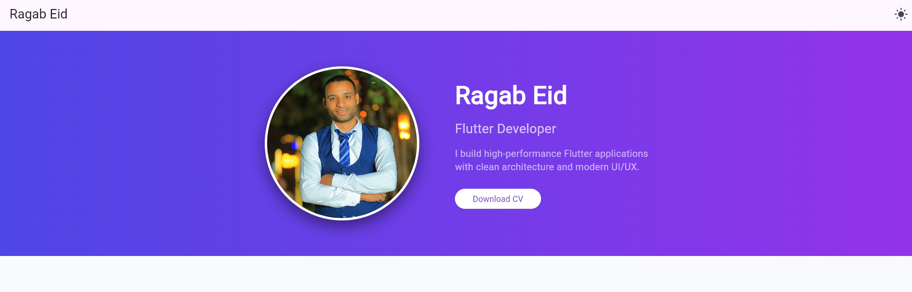

# 🚀 Flutter Web Portfolio - Ragab Eid


This is a professional personal portfolio website built with **Flutter Web**. It features a responsive design and is hosted via **Firebase Hosting**.

---

## 🛠 Tech Stack

* **Framework:** Flutter (Web).
* **Language:** Dart.
* **Hosting:** Firebase Hosting.
* **Design:** Responsive UI for Mobile & Desktop.

---

## ✨ Features

* **Responsive Layout:** Fully adaptive design using `LayoutBuilder`.
* **Achievements:** Showcasing technical milestones and professional growth.
* **Testimonials:** Clean UI cards displaying client and colleague feedback.
* **Contact Integration:** ragabeid5111999@gmail.com, 01128792749.

---

## 📸 Project Showcase

| Section | Preview |

| ------- | ------- |
| **Contact** | Interactive contact form. |
| **Projects** | Interactive project showcase. |
| **Main Header** | Professional introduction with orange accents. |
| **Achievements** | Grid of cards showing professional success. |
| **Testimonials** | Social proof and feedback section. |

---

## 🚀 Getting Started

1.  **Clone the repo:**
    ```bash
    git clone git@github.com:your-username/your-repo-name.git
    ```
2.  **Install dependencies:**
    ```bash
    flutter pub get
    ```
3.  **Build for web:**
    ```bash
    flutter build web --release
    ```

---

## 🌐 Live Link
Visit the live site: [https://boxwood-ray-479905-e5.web.app](https://boxwood-ray-479905-e5.web.app).